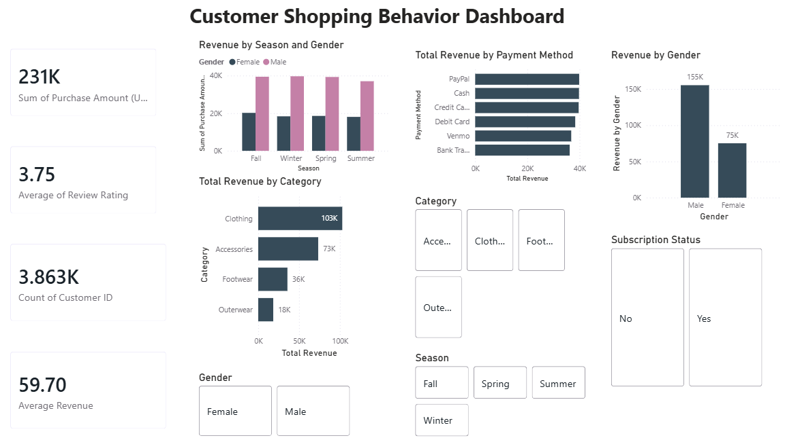

# Customer Shopping Behavior Dashboard

## Project Overview
## Dashboard Preview

This project analyzes customer shopping behavior using Power BI. The dashboard provides insights into customer purchases, revenue trends, payment methods, seasonal performance, and customer demographics.

## Tools Used

* Power BI
* Power Query
* CSV Dataset

## Key Performance Indicators (KPIs)

* Total Revenue: 231K
* Average Rating: 3.75
* Total Customers: 3.86K
* Average Revenue: 59.70

## Dashboard Features

* Revenue by Category
* Revenue by Gender
* Revenue by Season and Gender
* Revenue by Payment Method
* Interactive Filters for Gender, Category, Season, and Subscription Status

## Key Insights

* Clothing generates the highest revenue among all categories.
* Male customers contribute more revenue than female customers.
* Revenue varies across different seasons.
* Payment methods show relatively balanced usage across customers.

## Outcome

The dashboard helps businesses understand customer purchasing patterns and identify opportunities for improving sales performance and customer engagement.
